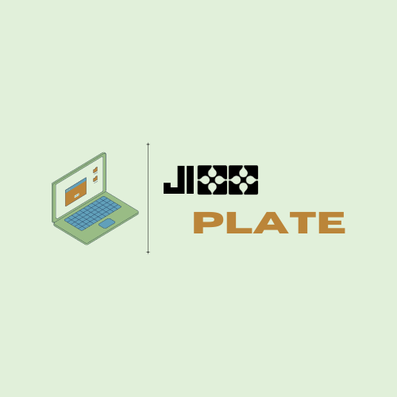

<!DOCTYPE html>
<html>
    <head> 
        <meta charset = "utf = 8">
        <title> Jixx </title>

        
    </head>

    <body>

        <h1>    Jixx Plate </h1>
        
            <h2> Introduction </h2>
            
Welcome to Jixx Plate, your go-to source for quality digital templates! 
                Our team is committed to providing you with an outstanding range of templates to support your projects. 
                We were founded with a passion for creativity and a commitment to simplicity. 
                Our goal is to enable creators of every skill to fully express their ideas and effortlessly accomplish their objectives. 
                We are here to support you at every stage of your creative journey, regardless of your experience level. 
                We are appreciative that you have Jixx Plate as your go-to source for digital templates. 
                Together, let's create something incredible! 

            <h2> Service </h2>
            
 View our selection of finely produced templates that are sure to make your projects shine. 
                We have everything you need, whether you're a professional presenter looking for elegant PowerPoint graphics, a scrapbooking fanatic looking for adorable layouts, or a parent trying to get your child interested in a busy book. 
                With the countless customization and personalization options available in our digital templates, you can let your creativity run wild and easily realize your vision. 
                With our adaptable digital templates, you can streamline your creative process and discover a world of inspiration right away! 

            <h2> About us </h2>
            
 Greetings from Jixx Plate! Our goal as a small group of IT enthusiasts is to facilitate and enhance your digital experience. 
                Our mission is to help you succeed by offering you digital products that are simple to use. 
                Jixx Plate is aware of how difficult it can be to get started in the digital world. 
                We are here to provide you with easy fixes to get started on your path because of this. 
                We provide something for everyone, including students, small company owners, and independent contractors. 
                We appreciate that you have decided to collaborate with Jixx Plate on your digital projects. 
                We're thrilled to accompany you on this adventure and are eager to see what you produce! 

    </body>
</html>
